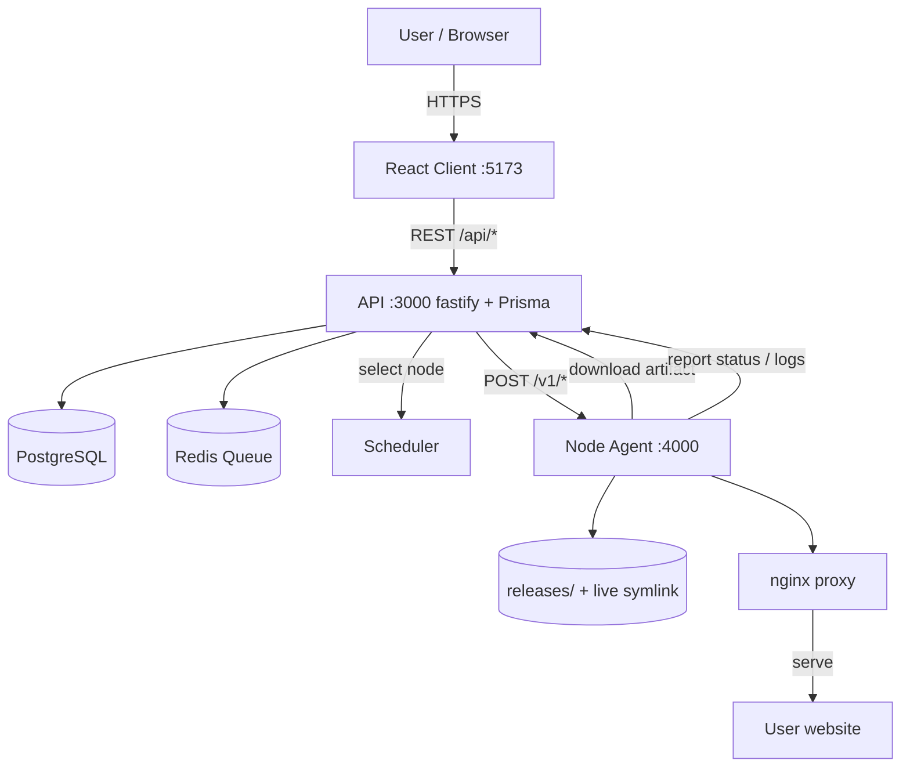

# BabaSTI Hosting — Control Plane

A self-hosted **hosting control plane** for publishing pre-built static web
projects from ZIP files. Users register, upload a release, and the platform
deploys it across hosting nodes with pinned placement, immutable releases,
health checks, rollback, and a default BabaSTI subdomain. Sandboxed builds,
GitHub source deployment, and verified custom domains are later phases.

> **Note:** This is a **client-facing application platform**. There is **no
> built-in admin panel** — accounts are regular user accounts. Account and
> website management happens entirely through the web client. (An administrative
> story can be layered on top later, but it is not part of this MVP.)

---

## Stack

| Layer        | Technology                                                        |
| ------------ | ----------------------------------------------------------------- |
| Frontend     | React 18 + Vite + TanStack Query + React Router                   |
| API          | Node.js + fastify + Prisma + PostgreSQL                           |
| Auth         | Session cookie (`@fastify/session`) + Google / GitHub OAuth       |
| Queue        | Redis-backed (BullMQ-style) job queue; in-memory fallback when `REDIS_URL` is empty |
| Hosting      | Hosting Node Agent (separate service) over HTTPS                  |
| Build/Deploy | Real provider dispatches to a Node Agent; Mock provider for dev/test |

## Repository layout

```
control-panel_BABANET/
├── apps/
│   ├── api/          # fastify API server + Prisma schema (root prisma/)
│   │   ├── e2e-verify.mjs   # real end-to-end verifier (20 checks)
│   │   ├── test/            # node:test suite + env bootstrap
│   │   └── src/
│   └── client/       # React + Vite web client
├── services/
│   └── node-agent/   # Hosting Node Agent deployed on each hosting node
├── packages/
│   ├── types/        # Shared domain types
│   ├── config/       # Central configuration / env schema
│   ├── shared/       # Logger, queue, scheduler, crypto utilities
│   └── validation/   # Request/response validation
├── docs/             # ARCHITECTURE, DEPLOYMENT, SECURITY, API
├── prisma/           # Prisma schema + migrations
└── docker-compose.yml
```

## Features

- **Account & auth** — email/password registration and login, Google & GitHub
  OAuth, session management with revocable sessions.
- **GitHub account integration** — OAuth and repository discovery are
  scaffolded; real source builds stay disabled until container isolation lands.
- **Website management** — create websites with auto-generated slugs and
  default domains (`<slug>.<DEFAULT_DOMAIN_SUFFIX>`), update metadata, delete.
- **Zero-downtime deployments** — builds produce immutable releases; live
  traffic switches only after the release is verified (atomic symlink swap).
  A failed deploy never replaces a working site.
- **Instant rollback** — roll back to any previous successful release in one
  call; the agent re-points the live directory and reloads nginx.
- **Custom domains (preview)** — attach domain metadata; activation remains
  pending until DNS verification and certificate automation are enabled.
- **Environment variables** — per-website environment variables with
  `public` / `private` / `secret` visibility.
- **Hosting nodes** — websites are scheduled onto hosting nodes; the control
  plane never touches the hypervisor or runs shell commands itself.
- **Observability** — deployment logs streamed from the agent, usage snapshots,
  and a `/health` endpoint.

---

## Architecture overview



The control plane is responsible for **orchestration and state**. All
**execution** (building, writing files, reloading the web server) happens on a
Hosting Node Agent. This keeps the control plane stateless with respect to
runtime infrastructure and means the browser never talks to Proxmox or any
underlying hypervisor.

See [`docs/ARCHITECTURE.md`](docs/ARCHITECTURE.md) for the full component map
and request/response contracts.

---

## Local development

Prerequisites: **Node.js >= 20**, **Docker** (for Postgres + Redis), and the
package manager **npm** (workspaces).

```powershell
# 1. Install dependencies (workspace install)
npm install

# 2. Start Postgres + Redis
docker compose up -d

# 3. Create your environment file
Copy-Item .env.example .env

# 4. Generate the Prisma client and apply migrations
npx prisma generate
npx prisma migrate deploy

# 5. Run the three services in separate terminals:
npm run dev:api      # API on http://localhost:3000
npm run dev:client  # Client on http://localhost:5173
npm run dev:agent   # Node Agent on http://localhost:4000
```

> There is no combined `npm run dev` script. Run `dev:api`, `dev:client`, and
> `dev:agent` in three terminals (or use your own process manager such as
> `concurrently`).

By default the **Mock** provider is active (`DEPLOYMENT_PROVIDER=mock`), which
simulates deployments in-process so you can exercise the full UI without a real
node agent. To use the real provider, set `DEPLOYMENT_PROVIDER=real` and point
each agent's `PUBLIC_AGENT_URL` at its private/tunneled endpoint (see
[`docs/DEPLOYMENT.md`](docs/DEPLOYMENT.md)).

Useful scripts:

```powershell
npm run dev:api       # API with watch
npm run dev:client    # Vite dev server
npm run dev:agent     # Node Agent with watch
npm run build         # tsc -b (type-check + emit all packages & apps)
npm run typecheck     # tsc -b (type-check only)
npm test              # run the API test suite (apps/api)
npm run db:studio     # Prisma Studio
npm run db:migrate    # prisma migrate dev
npx prisma generate   # regenerate the Prisma client
```

## Environment variables

All variables are validated at startup through a central schema
(`packages/config`). The server refuses to boot if a required value is missing
or invalid.

| Variable                 | Default            | Required | Purpose                                                                 |
| ------------------------ | ------------------ | -------- | ----------------------------------------------------------------------- |
| `NODE_ENV`               | `development`      | yes      | `development` \| `test` \| `production`                                 |
| `DATABASE_URL`           | —                  | yes      | PostgreSQL connection string                                             |
| `API_PORT`               | `3000`             | no       | Port the API listens on                                                 |
| `API_HOST`               | `0.0.0.0`          | no       | Bind host for the API                                                   |
| `CLIENT_URL`             | `http://localhost:5173` | yes  | Allowed CORS origin and session cookie domain                           |
| `SESSION_SECRET`         | —                  | yes      | Cookie session signing secret (min 16 chars)                            |
| `SESSION_TTL`            | `604800`           | no       | Session lifetime in seconds                                             |
| `COOKIE_SECURE`          | `false`            | no       | Set `true` in production (HTTPS-only cookies)                           |
| `GOOGLE_CLIENT_ID`       | —                  | no*      | Google OAuth client id                                                  |
| `GOOGLE_CLIENT_SECRET`   | —                  | no*      | Google OAuth client secret                                              |
| `GOOGLE_CALLBACK_URL`    | —                  | no*      | Google OAuth callback (`/api/auth/google/callback`)                     |
| `GITHUB_CLIENT_ID`       | —                  | no*      | GitHub OAuth client id                                                   |
| `GITHUB_CLIENT_SECRET`   | —                  | no*      | GitHub OAuth client secret                                              |
| `GITHUB_CALLBACK_URL`    | —                  | no*      | GitHub OAuth callback (`/api/github/callback`)                         |
| `DEPLOYMENT_PROVIDER`    | `mock`             | no       | `mock` \| `real`                                                        |
| `NODE_AGENT_URL`         | `""`               | no       | Legacy single-node URL fallback                                        |
| `NODE_AGENT_TOKEN`       | `""`               | agent*   | Unique bearer token for one Node Agent                                 |
| `NODE_REGISTRATION_TOKEN` | `""`              | real*    | Registration-only bootstrap credential                                 |
| `NODE_HEARTBEAT_INTERVAL_SECONDS` | `30`       | no       | Agent heartbeat frequency                                               |
| `NODE_HEARTBEAT_TTL_SECONDS` | `90`            | no       | Time before a silent node becomes offline                              |
| `CONTROL_PLANE_URL`      | —                  | real*    | Public base URL the agent uses to reach the control plane               |
| `STORAGE_PATH`           | `./data/storage`   | no       | Root storage for release artifacts (control plane side)                  |
| `AGENT_STORAGE`          | `""` (→ `STORAGE_PATH`) | no | Override storage root for agent-managed releases; falls back to `STORAGE_PATH` |
| `AGENT_NGINX_CONFIG_DIR` | `""`               | real*    | nginx include directory used for live vhosts                            |
| `REDIS_URL`              | `""`               | no       | Redis connection URL. **An empty value is valid** — it enables the in-memory queue (used in tests and local dev without Redis) |
| `MAX_WEBSITES_PER_USER`  | `3`                 | no       | Mini-plan website limit                                                 |
| `MAX_DEPLOYMENTS_PER_DAY` | `10`               | no       | Daily deployment limit                                                  |
| `MAX_CONCURRENT_DEPLOYMENTS_PER_USER` | `1`    | no       | Parallel deployment limit                                               |
| `DEFAULT_DOMAIN_SUFFIX`  | `babasti.my.id`    | no       | Suffix for auto-generated default domains                               |
| `CLOUDFLARE_API_TOKEN`   | `""`               | real*    | Zone-scoped DNS Write token used by the control plane                    |
| `CLOUDFLARE_ZONE_ID`     | `""`               | real*    | Cloudflare zone receiving per-site CNAME records                         |
| `CLOUDFLARE_TUNNEL_TARGET` | `""`             | agent*   | This node's `<UUID>.cfargotunnel.com` target                             |
| `CLOUDFLARE_ACCESS_CLIENT_ID` | `""`           | no       | Optional Access service-token client id for private service hostnames    |
| `CLOUDFLARE_ACCESS_CLIENT_SECRET` | `""`       | no       | Optional Access service-token secret; set together with the client id    |
| `ENCRYPTION_KEY`         | — (→ `SESSION_SECRET`) | no  | Key for AES-256-GCM secrets; defaults to `SESSION_SECRET` if unset      |

`*` Required only when the corresponding feature is enabled (OAuth providers are
optional; production agents require unique node tokens, a registration token,
`PUBLIC_AGENT_URL`, `CONTROL_PLANE_URL`, and an nginx config directory).

## Verification

### Automated tests

```powershell
npm test   # discovers and runs API plus Node Agent tests
```

### Real end-to-end verification

A reproducible verifier exercises the **full Real Provider → Node Agent**
lifecycle (register → create website → deploy release → atomic switch → nginx
validation → health check → rollback). See
[`docs/DEPLOYMENT.md`](docs/DEPLOYMENT.md#real-end-to-end-verification) for the
exact command sequence and expected results.

## Documentation

- [`docs/ARCHITECTURE.md`](docs/ARCHITECTURE.md) — components, data model, control-plane ↔ agent contract.
- [`docs/DEPLOYMENT.md`](docs/DEPLOYMENT.md) — running the real provider, release structure, rollback safety.
- [`docs/PROXMOX-ROLLOUT.md`](docs/PROXMOX-ROLLOUT.md) — two-server BabaSTI rollout, resource plan, Cloudflare routing, verification, and rollback.
- [`docs/SECURITY.md`](docs/SECURITY.md) — auth, secrets, CORS, rate limiting, agent hardening.
- [`docs/API.md`](docs/API.md) — full HTTP API reference (client + internal).

## License

Proprietary — BabaSTI.
# controlPanel-BABASTI
