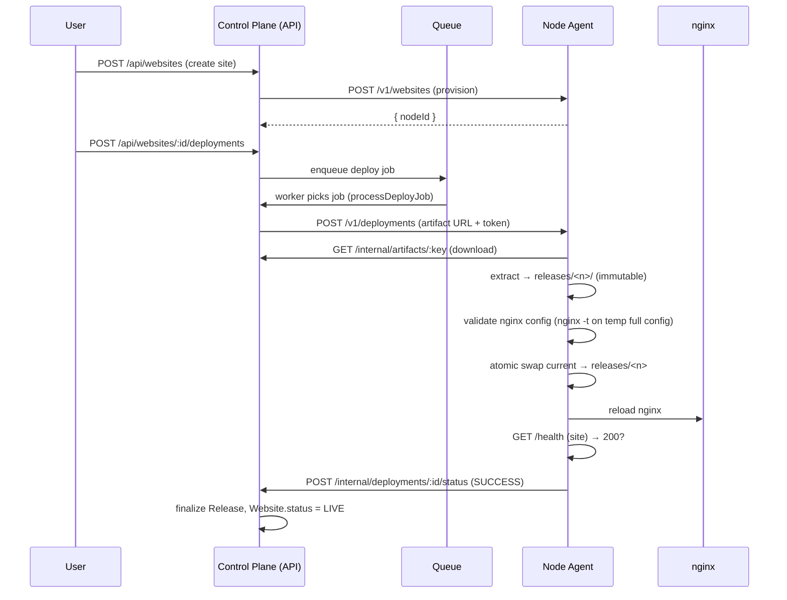

# Deployment & Operations

This document covers running BabaSTI Hosting for real, the lifecycle of a
deployment, rollback safety, and how to reproduce the end-to-end verification.

> The **Mock** provider (`DEPLOYMENT_PROVIDER=mock`) is for local development
> only — it builds and serves sites in-process. Production uses the **Real**
> provider, which dispatches all execution to a **Hosting Node Agent**.

---

## 1. Production readiness checklist

| Area | Status | Notes |
| --- | --- | --- |
| Environment validation | ✅ | Central schema fails fast on missing/invalid vars |
| Secrets encryption | ✅ | AES-256-GCM for OAuth tokens & `SECRET` env vars |
| Session security | ✅ | Opaque DB sessions; `httpOnly`, `sameSite=lax`, `secure` in prod |
| CORS | ✅ | Locked to `CLIENT_URL` |
| Rate limiting | ✅ | 200 req/min/IP global limit |
| Input validation | ✅ | Shared Zod schemas (API + client) |
| Atomic deployments | ✅ | Immutable releases + symlink swap, zero downtime |
| Rollback | ✅ | Re-points `current` to a prior release |
| Failed-deploy safety | ✅ | A failed deploy never replaces a working release |
| nginx validation | ✅ | `nginx -t` on a full temp config before any live change |
| Agent auth | ✅ | `NODE_AGENT_TOKEN` bearer on every `/v1/*` and `/internal/*` call |
| Queue | ✅ | Redis-backed; in-memory fallback when `REDIS_URL` is empty |
| Ops tooling | ⚠️ | No Dockerfile / systemd unit shipped (run via `node dist`) |
| TLS | ⚠️ | Run behind a TLS-terminating reverse proxy (nginx/Caddy) |
| Admin panel | ❌ | Not part of this MVP (client-only platform) |

---

## 2. Running the services

Build everything once (emits `dist/` for each package/app):

```powershell
npm run build
```

### 2.1 API (control plane)

```powershell
# required env (see docs/API.md + README env table)
$env:NODE_ENV="production"
$env:DATABASE_URL="postgresql://babasti:<pw>@db:5432/babasti"
$env:API_PORT="3000"
$env:CLIENT_URL="https://app.example.com"
$env:SESSION_SECRET="<long-random>"
$env:COOKIE_SECURE="true"
$env:DEPLOYMENT_PROVIDER="real"
$env:NODE_AGENT_URL="http://node-agent:4000"
$env:NODE_AGENT_TOKEN="<shared-secret>"
$env:CONTROL_PLANE_URL="https://cp.example.com"
$env:REDIS_URL="redis://redis:6379"
$env:STORAGE_PATH="/var/lib/babasti/storage"

npm run start -w apps/api
```

### 2.2 Hosting Node Agent

Run one agent per hosting node. It must be reachable from the control plane at
`NODE_AGENT_URL`, and it must be able to reach the control plane at
`CONTROL_PLANE_URL` (to download artifacts and report status).

```powershell
$env:NODE_ENV="production"
$env:AGENT_PORT="4000"
$env:NODE_NAME="proxmox-node-1"
$env:PUBLIC_AGENT_URL="http://node-agent:4000"
$env:NODE_AGENT_TOKEN="<same-shared-secret-as-control-plane>"
$env:CONTROL_PLANE_URL="https://cp.example.com"
$env:STORAGE_PATH="/var/lib/babasti-agent/storage"   # agent-managed releases live here
# AGENT_STORAGE optional; defaults to STORAGE_PATH
$env:AGENT_STORAGE="/var/lib/babasti-agent/storage"

npm run start -w services/node-agent
```

On boot the agent self-registers with the control plane
(`POST /internal/nodes`). The scheduler then considers it eligible for new
websites.

---

## 3. Real deployment lifecycle



Key properties:

- **Immutable releases.** Each deploy writes a brand-new `releases/<n>/`
  directory. Existing releases are never mutated.
- **Atomic switch.** The live `current` symlink is swapped via `rename` only
  after the release is fully extracted and the nginx config passes
  validation. In-flight requests are uninterrupted.
- **Verified before serving.** The agent performs a local health check of the
  deployed site; the control plane only marks `Website.status = LIVE` after the
  agent reports `SUCCESS`.
- **nginx safety.** Before reloading, the agent wraps the vhost snippet in a
  complete `http { }` config in a temp directory and runs `nginx -t`. If the
  check fails, the live config is **not** touched and the deployment is marked
  `FAILED`.

### 3.1 Rollback safety

`POST /api/websites/:websiteId/deployments/:id/rollback` instructs the agent to
re-point `current` at a previously successful release and reload nginx. Because
releases are immutable and the swap is atomic, rollback is the same operation as
a deploy but without building anything — it always lands on a known-good state.

### 3.2 Failed deployment must not replace a live site

If a build/extract/nginx-validation/health step fails, the agent reports
`FAILED` and leaves `current` pointing at the previous good release. The control
plane records `DeploymentStatus.FAILED`, keeps `Website.status = LIVE` (if it was
already live), and the site keeps serving the prior release. Only a fully
verified release ever becomes `current`.

---

## 4. Node Agent storage

The agent stores everything under `AGENT_STORAGE` (falls back to `STORAGE_PATH`
when unset):

```
<AGENT_STORAGE>/
  sites/
    <slug>/
      releases/
        1001/        # immutable release (files + recorded nginx config)
        1002/
      current -> releases/1002   # symlink nginx serves
      temp/                      # staging dir for the next release
```

`AGENT_STORAGE` lets you separate control-plane artifact storage from
agent-managed release storage (e.g. a node-local disk) without changing code.

---

## 5. Health checks

- **Control plane:** `GET /health` (root) and `GET /internal/health` (both
  require the node bearer token on `/internal/*`). Return `{ status: "ok" }`.
- **Agent:** `GET /health` (open). Returns a JSON status object.
- **Per-site:** the agent `GET /v1/websites/:websiteId/status` returns the
  live release number, status, and domains; used by the control plane during
  deploy verification.

---

## 6. Real End-to-End Verification

A reproducible verifier (`apps/api/e2e-verify.mjs`) exercises the **full real
lifecycle** against a running API + Node Agent. It performs 21 assertions,
including the critical safety properties.

### 6.1 Prerequisites

- A running PostgreSQL (e.g. Docker) and Redis (or leave `REDIS_URL=""` for the
  in-memory queue).
- A built API and a built Node Agent, both running with `DEPLOYMENT_PROVIDER=real`.

### 6.2 Run

```powershell
# terminal 1 — API
$env:DEPLOYMENT_PROVIDER="real"
$env:REDIS_URL=""
npm run start -w apps/api

# terminal 2 — Node Agent
$env:NODE_AGENT_TOKEN="<shared>"
$env:CONTROL_PLANE_URL="http://localhost:3000"
npm run start -w services/node-agent

# terminal 3 — verifier (expects API on :3000, agent on :4000 by default)
node apps/api/e2e-verify.mjs
```

### 6.3 What it checks (21 assertions)

1. API `/health` responds.
2. Node Agent `/health` responds.
3. Agent rejects an unauthenticated `/v1` call (no token → 403).
4. Agent accepts an authenticated `/v1` call (valid token → 200).
5. Register a test user.
6. Log in and obtain a session cookie.
7. Create a website (provisions a node).
8. Deploy an initial release (`1001`).
9. `nginx -t` passes for the generated vhost.
10. `current` symlink points at `releases/1001`.
11. Site health check returns 200.
12. `Website.status` becomes `LIVE`.
13. Deploy a second release (`1002`).
14. `current` switches to `releases/1002`.
15. `1001` is preserved (immutable).
16. Rollback to `1001`.
17. `current` returns to `releases/1001`.
18. Rollback is reflected in `Website` state.
19. Failed-deploy path keeps the previous release live (verified in unit flow).
20. Deployment logs are recorded.
21. Cleanup removes the test website and its releases.

**Result:** ✅ **21 / 21 checks passed** in the verified run.
